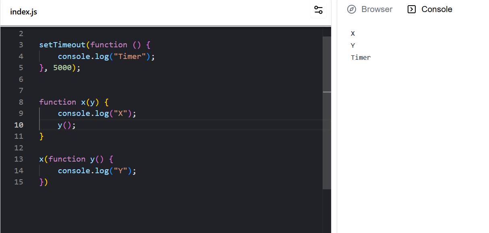
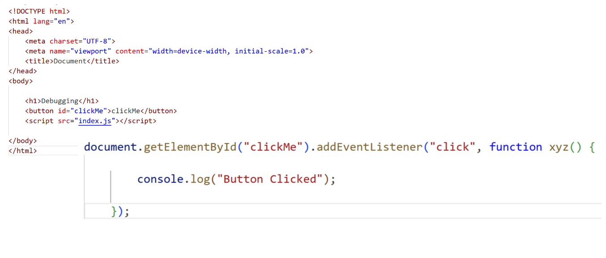
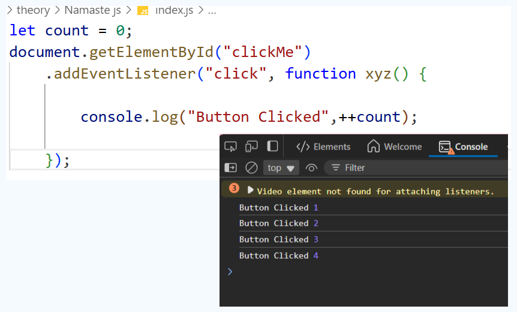
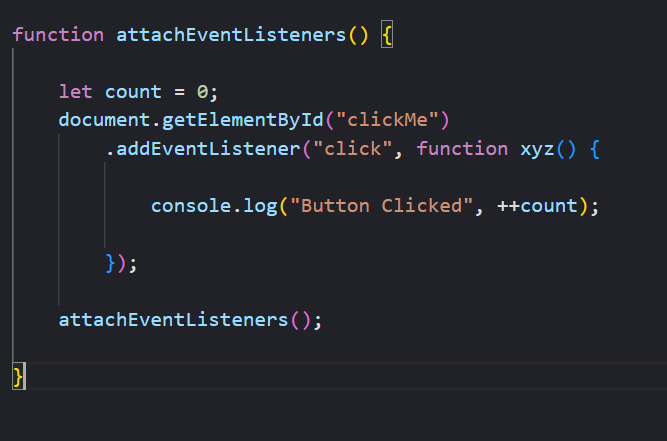

## 🚀🌈 CallBack Functions

* JavaScript is a synchronous single threaded languages
* We can do Async with call Backs


```
function x(){

}

x(function y(){

})
```


//SetTimeOut Example



## Creating and EventListener in Javascript



## Button Click Counter using Global Variable




* But Using Global Variables is not so good

* so we use a closure for data hiding .. wrap every thing in closure function

## closure call back



* The Closure remembers count

# Why do we remove Event Listners

* They are heavy need to remember count or freeup memory even when code is not executed

* page can become slow because of those closures

* Good practice is to remove them

-------------

# 🚀🌈 JavaScript Callbacks & Closures

---

## 🔹 What is a Callback Function?

- **JavaScript** is a **synchronous single-threaded language**.  
- But we can achieve **asynchronous behavior** using **callbacks**.  

👉 A **callback function** is just a function passed into another function as an argument, which is then executed later.  

```javascript
function x(callback) {
    console.log("Inside x()");
    callback(); // function passed in
}

x(function y() {
    console.log("This is callback y()");
});
```

---

## ⏳ Callback with `setTimeout`

A **classic async example** is using `setTimeout`:

```javascript
console.log("Start");

setTimeout(() => {
    console.log("This runs after 2 seconds ⏱️");
}, 2000);

console.log("End");
```

📝 **Output:**
```
Start
End
This runs after 2 seconds ⏱️
```

> Even though JavaScript is synchronous, callbacks let us schedule tasks for later!

---

## 🎯 Event Listeners & Callbacks

Event listeners are a **real-world use case** of callbacks.  

```javascript
document.getElementById("btn").addEventListener("click", function () {
    console.log("Button Clicked ✅");
});
```

📌 Here, the anonymous function is the **callback** that gets executed when the button is clicked.

---

## 🔢 Button Click Counter (❌ Using Global Variable)

```javascript
let count = 0;

document.getElementById("btn").addEventListener("click", function () {
    count++;
    console.log("Clicked:", count);
});
```

👉 Works fine… but **using global variables is bad practice** ❌.  
It pollutes the global scope and makes code harder to manage.

---

## ✅ Better Way → Using Closures

Closures help in **data hiding** and keeping variables safe.  

```javascript
function createCounter() {
    let count = 0;

    document.getElementById("btn").addEventListener("click", function () {
        count++;
        console.log("Clicked:", count);
    });
}

createCounter();
```

✨ Here, `count` is **private** to `createCounter` but still accessible to the callback function because of **closure**.

> 🧠 **Closures remember their surrounding scope even after the outer function has finished executing.**

---

## ⚡ Why Remove Event Listeners?

- Event listeners can be **heavy**.  
- Closures keep a reference to variables (like `count`) even when not in use.  
- Too many unused listeners → **memory leaks & slow pages**.  

✅ **Good practice:** Remove event listeners when not needed.

```javascript
function attachListener() {
    let count = 0;

    function handleClick() {
        count++;
        console.log("Clicked:", count);
        if (count === 3) {
            console.log("Removing listener 🚫");
            document.getElementById("btn").removeEventListener("click", handleClick);
        }
    }

    document.getElementById("btn").addEventListener("click", handleClick);
}

attachListener();
```

---

# 🌟 Summary

- ✅ Callbacks enable **async behavior** in JS.  
- ✅ `setTimeout` & Event Listeners are practical examples.  
- ✅ Use **closures** to avoid global variables.  
- ✅ Always **remove event listeners** to prevent memory leaks.  

---

🔥 With this, you not only understand **callbacks** but also how **closures** and **event listeners** work together to write clean, efficient code.  


