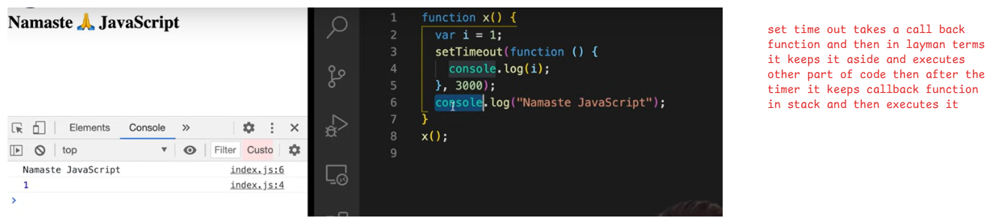
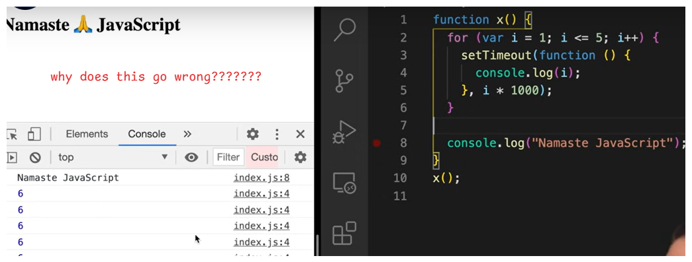
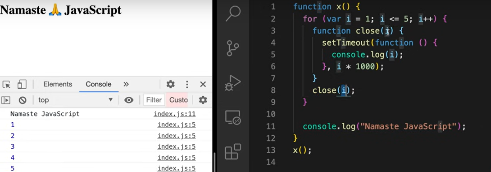

# SET TIMEOUT



# Print 1 2 3 4 5 using set time out



```
The reference for all functions is same
javascript will not wait for timer to complete it just increments i to 6 and all other functions points to that i=6
```

**Solution**
```
use let instead of var in for loop
why? - > bcs let has block scope
output : 12345
```

## What if let is not allowed  ?
* call the function every time with new i value



## Double paranthases

```
function outer(){
    var a = 10;
    function inner(){
        console.log(a);
    }
    return inner;
}
outer()();

* my function return a  function iam just executing function returned to me 
```


