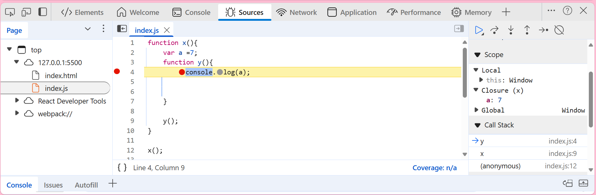

# Closure

A **closure** in JavaScript is formed when a function is bundled together with its **lexical scope** — meaning it remembers the variables from the scope in which it was created.

## 🔹 Definition
> A **closure** is a function along with its **lexical environment**.

---

## 📌 Example

```js
function x() {
    var a = 7;

    function y() {
        console.log(a); // y "closes over" variable `a` from its parent scope
    }

    y(); // Outputs: 7
}

x();
```

In this example:
- Function `y()` is **defined inside** `x()`.
- It accesses variable `a`, which is in its **lexical scope**.
- Hence, `y()` forms a **closure** over `a`.

---

## 📷 Visual Representation



In the above image:
- `y()` is enclosed inside `x()`
- `y()` forms a closure with the lexical parent `x()`, retaining access to variable `a` even after `x()` finishes execution (if returned).

---

## 💡 Key Points

- Closures are created **every time** a function is created inside another function.
- They are commonly used for:
  - **Data hiding / encapsulation**
  - **Function factories**
  - **Callbacks and asynchronous code**