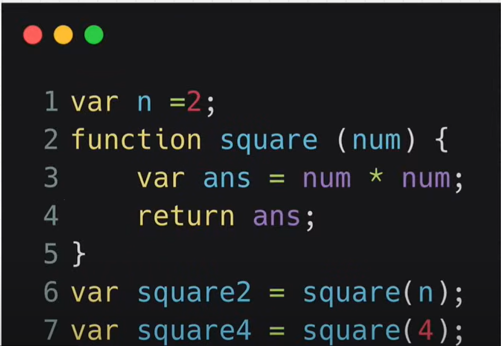
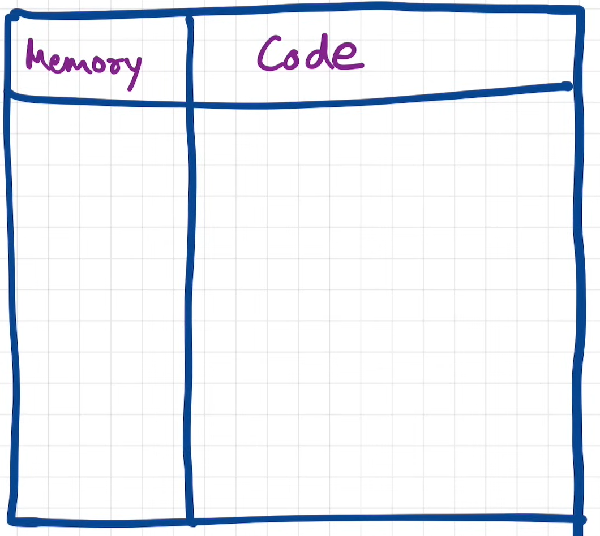
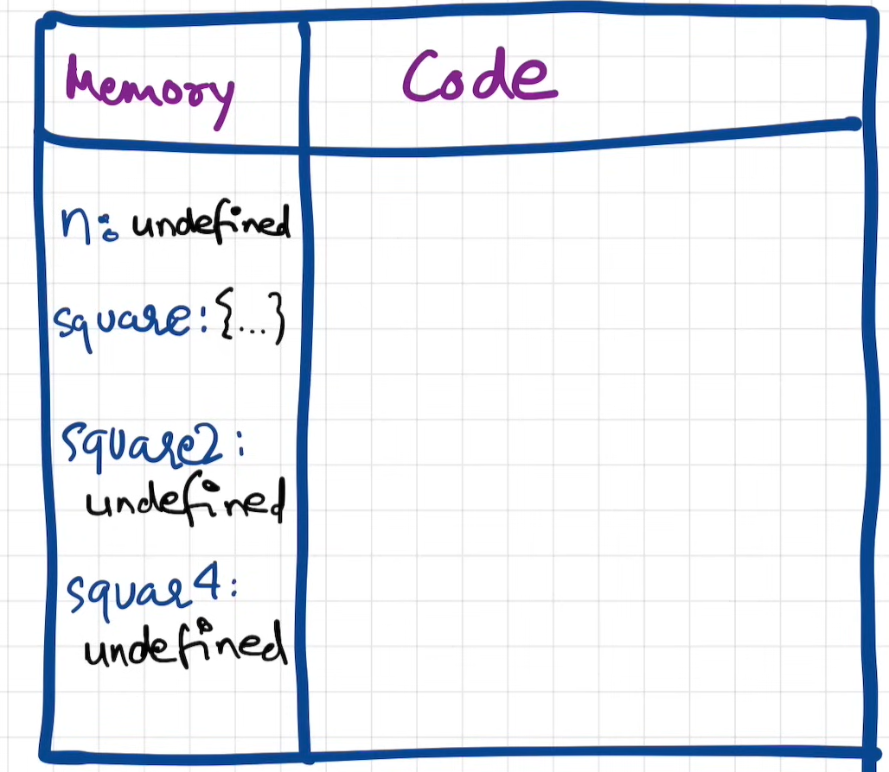
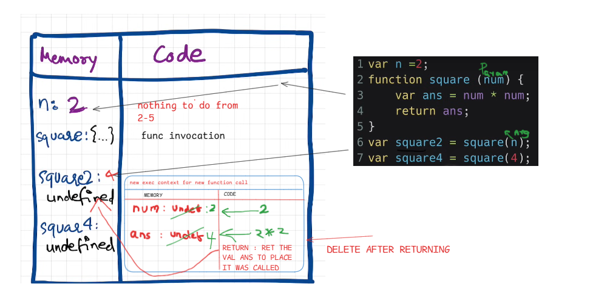
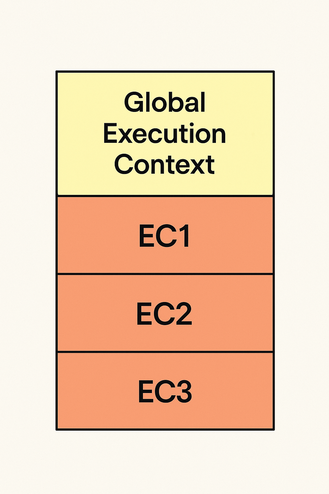

# ⚙️ Working of Execution Context

---

## 📌 1. Creation Phase

During the creation phase, the JavaScript engine sets up the execution context:

- A **global object** is created (`window` in browsers, `global` in Node.js).
- A special variable `this` is initialized.
- Memory is allocated for:
  - All **variables** (initialized as `undefined`)
  - All **function declarations** (entire function is stored)

---

## 🧠 2. Memory Allocation

In this phase:

- Every variable is stored in memory and initialized with `undefined`.
- Functions are stored **along with their full definition/code** (not just `undefined`).

## 🚀 3. Code Execution phase

## Call Stack in js

