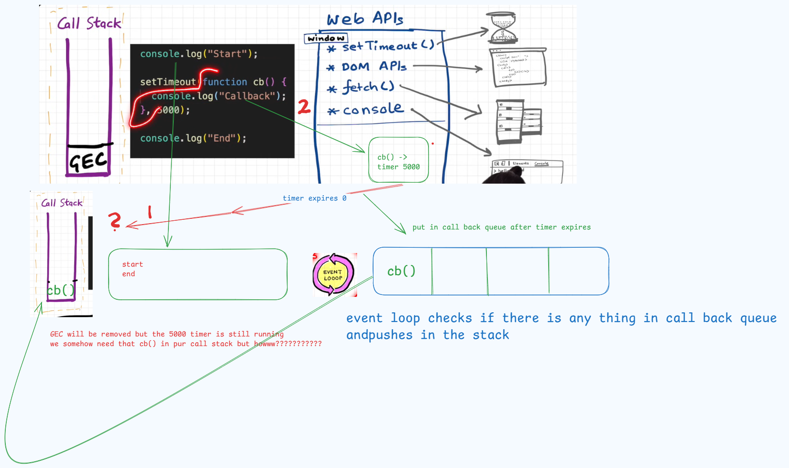

# ⚡ Event Loops in JavaScript


---

### 🔹 How JavaScript Executes Code

- JavaScript is **synchronous** and **single-threaded**.  
- It means JavaScript does **not wait** for anyone – it executes line by line.  
- As soon as the code enters the **Call Stack**, the **Execution Context** of `A()` gets created, executed, prints `A`, then removed from the stack.  
- After that, it continues execution and prints `End`.  

---

### 🤔 But What If We Want JavaScript to Wait?

JavaScript itself **cannot wait** because it blocks execution.  
That’s where the **Browser** comes into play.  

✅ The browser is one of the most remarkable inventions of humankind because:  
- It has **timers**  
- It can **communicate with external servers**  
- It can **update the UI dynamically**

To give JavaScript **superpowers**, it connects with the **Browser Environment**.


---

### 🌍 Browser Superpowers (Web APIs)

The browser provides built-in **Web APIs**, which JavaScript can use through the Event Loop:

- **`setTimeout`** → Schedule code to run later.  
- **DOM APIs** → Interact with and update the webpage elements.  
- **`fetch`** → Make network requests to servers.  
- **`localStorage`** → Store data in the browser permanently.  
- **`console`** → Log data for debugging.  
- **`location`** → Access or update the current URL.  


The web apis are plugged with help of GEC's window 

---

⚡ In short:  
JavaScript alone is powerful, but when combined with the **Browser and its Web APIs**, it becomes truly **asynchronous and non-blocking**, enabling smooth experiences like timers, server calls, and UI updates.

# How Set Timeout Work behind the scenes



## Event Listner


## ⏳ fetch and Promises

- `fetch()` returns a **Promise**.  
- Promises are not executed immediately in the call stack.  
- Instead, they are pushed to the **Microtask Queue**, and executed **after the current synchronous code finishes**.

---

### 🔄 Queues in Event Loop


- **Microtask Queue (High Priority)**  
  - Contains **resolved/rejected promises** (like `fetch().then(...)`).  
  - Always executed **before** the Callback Queue.  

- **Callback Queue (Normal Priority)**  
  - Contains callbacks like `setTimeout`, `setInterval`, DOM events.  
  - Executed only **after** Microtask Queue is empty.  

---

✅ Flow:  
1. JavaScript executes all **synchronous code** (e.g., a million lines).  
2. Once that finishes, the **Event Loop** checks the **Microtask Queue**.  
3. If microtasks exist, they are executed first.  
4. Only after microtasks are done, the **Callback Queue** executes.

---

### ⚡ Example Code

```javascript
console.log("Start");

setTimeout(() => {
  console.log("setTimeout Callback");
}, 0);

fetch("https://jsonplaceholder.typicode.com/todos/1")
  .then(() => console.log("Fetch Promise Resolved"));

console.log("End");

Start
End
Fetch Promise Resolved
setTimeout Callback
```

---

### ⚠️ Starvation in Callback Queue

Since the **Microtask Queue** (Promises, `fetch`, `MutationObserver`) has **higher priority**, it is always executed before the **Callback Queue**.  

👉 If new microtasks keep getting added continuously inside `.then()` or `Promise.resolve().then(...)`, the **Callback Queue may starve** — meaning callbacks like `setTimeout` or DOM events will be delayed for a long time.  

Example:

```javascript
setTimeout(() => {
  console.log("setTimeout Callback");
}, 0);

function run() {
  Promise.resolve().then(() => {
    console.log("Microtask running");
    run(); // keeps adding more microtasks
  });
}
run();


