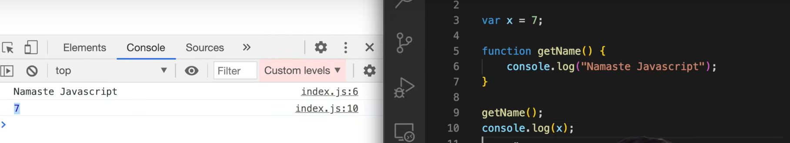
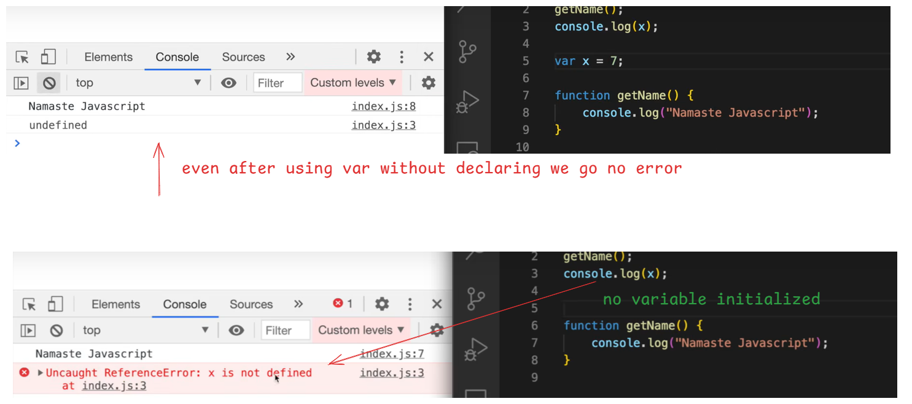
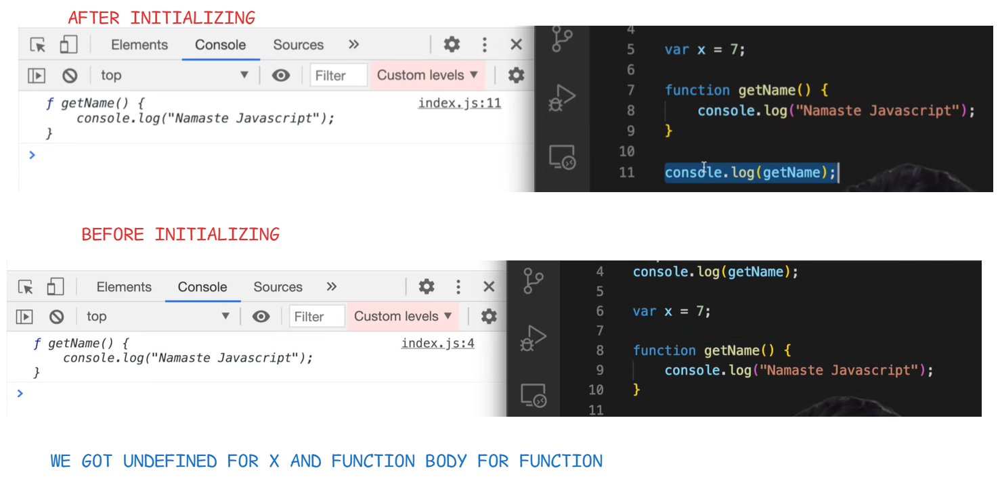
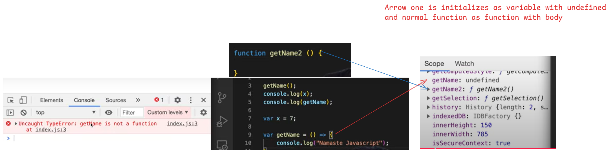

# 🔄 Normally What Happens in JavaScript

# 🔄 Hoisting in JavaScript

---

Hoisting is a behavior in JavaScript where **variable and function declarations are moved to the top** of their containing scope during the **creation phase** of the execution context.

This means you can refer to variables and functions **before** they are declared in the code.

---

Memory is Allocated even before code execution

# 🧠 JavaScript: Undefined vs Not Defined

Understanding the difference between `undefined` and `not defined` is essential for debugging JavaScript code.

---

## ✅ Undefined

> A variable is declared but **not yet assigned** a value — JavaScript automatically assigns it the value `undefined`.

## ✅ Notdefined
> Not defined or declared in entire code

# 🚀 Hoisting in Arrow Functions

In JavaScript, **hoisting** refers to the behavior where variable and function declarations are moved to the top of their scope during compilation.

But what about **arrow functions**?

---

## ❓ Are Arrow Functions Hoisted?

🔴 **No, arrow functions are _not hoisted_ like regular functions.**  
They are treated like **variable assignments** using `const` or `let`.
