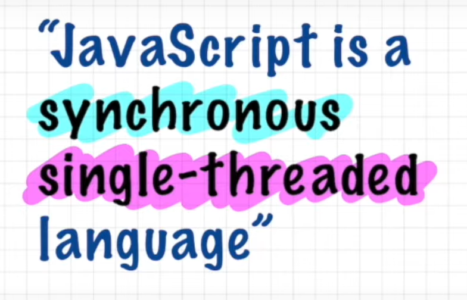
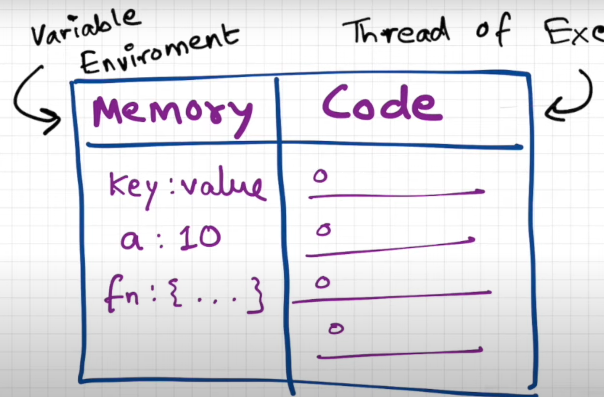

# 🚀 Introduction to JavaScript

JavaScript is a powerful, high-level scripting language that drives interactivity on the web.

# 🧪 JavaScript is a Loosely Typed Language

In JavaScript, you don’t need to declare variable types.  
The language is **loosely typed** (also called **dynamically typed**) — meaning:

> 🟡 **Variables can hold values of any data type**, and the type can change at runtime

---

## 📌 Everything in JavaScript Happens Inside the **Execution Context**

When any JavaScript code runs, it's executed inside an **Execution Context**.

---

### 🔄 What is an Execution Context?

An **Execution Context** is the environment in which JavaScript code is evaluated and executed.  

It has **two main components**:

1. 🧠 **Memory Component** (also called **Variable Environment**):
   - Stores variables and functions as key-value pairs.
   - Allocated during the *Creation Phase* of execution.

2. ⚙️ **Code Component** (also known as **Thread of Execution**):
   - Executes one line of code at a time.
   - Happens during the *Execution Phase*.

---
## 📌 JavaScript: A Synchronous, Single-Threaded Language

---

### 🧵 **Single-Threaded**
- JavaScript has **only one call stack**.
- It can execute **only one command at a time**.
- Think of it like a one-way street — one car (instruction) goes at a time.

---

### ⏱️ **Synchronous**
- JavaScript executes code **line-by-line** and in **order**.
- It will **not move to the next line** until the current one finishes.

