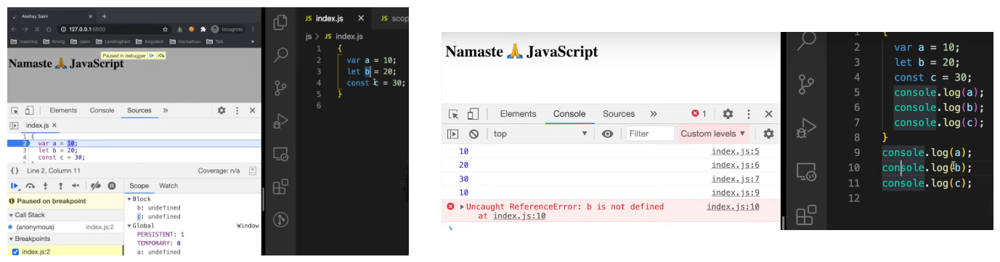

# JavaScript Block (Compound Statement)

## What is a Block?

A **block** in JavaScript is a group of zero or more statements enclosed in curly braces `{}`.

```js
{
  // This is a block
}
```

## Purpose of a Block

- A block **does nothing by itself**.
- Also known as a **compound statement**.
- Used to **combine multiple JavaScript statements into a single group**.

## Why Use a Block?

JavaScript often expects **a single statement** in places like `if`, `for`, `while`, and `function` bodies.  
If you need to run multiple statements in such places, you must use a block.

### ❌ Without Block (Only one statement allowed)
```js
if (true)
  console.log("Hello");
```

### ✅ With Block (Multiple statements allowed)
```js
if (true) {
  console.log("Hello");
  console.log("World");
}
```



>### one declared in var would be global and will be available even after scope ends 

# Shadowing and Illegal Shadowing in JavaScript

## 🔹 What is Shadowing?

**Shadowing** occurs when a variable declared within a certain scope (like a block or function) has the **same name** as a variable in an outer scope.  
The inner variable **"shadows"** or overrides access to the outer variable in that scope.

### ✅ Example of Valid Shadowing
```js
let a = 10;

{
  let a = 20; // This shadows the outer 'a'
  console.log(a); // 20
}

console.log(a); // 10 (outer 'a' is unaffected)
```

Here, the inner `a` is scoped to the block and doesn't change the outer `a`.

---

## 🔸 What is Illegal Shadowing?

**Illegal shadowing** happens when you try to shadow a variable **declared with `let` or `const`** using **`var` in the same or inner scope**, which is **not allowed** in JavaScript.

### ❌ Example of Illegal Shadowing
```js
let x = 100;

{
  var x = 200; // ❌ SyntaxError: Identifier 'x' has already been declared
}
```

Here, you're trying to redeclare a `let` variable (`x`) using `var`, which is not allowed.

---

### ✅ Legal Shadowing (opposite way works)
```js
var y = 100;

{
  let y = 200; // ✅ Valid shadowing
  console.log(y); // 200
}

console.log(y); // 100
```

When the **outer variable is `var`** and the **inner one is `let` or `const`**, it is legal.

---

## 💡 Summary

| Shadowing Type        | Allowed? | Notes                                                  |
|------------------------|----------|---------------------------------------------------------|
| `let` → `let`          | ✅       | Block scoped; valid                                     |
| `var` → `let`          | ✅       | Valid; inner block scope                                |
| `let` → `var`          | ❌       | ❌ Illegal shadowing — not allowed                       |
| `const` → `var`        | ❌       | ❌ Illegal shadowing — not allowed                       |
| `const` → `const`      | ✅       | Valid if scoped differently                             |

- Prefer `let` and `const` to avoid confusion and bugs.
- Avoid using the same variable names in nested scopes unless necessary.