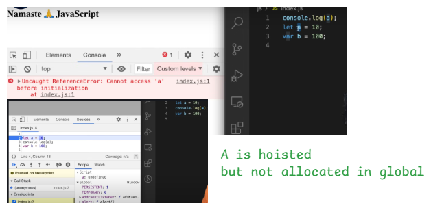

# JavaScript Hoisting and Temporal Dead Zone (TDZ)

## 📌 What is Hoisting?

In JavaScript, **hoisting** is the behavior where variable and function declarations are **moved to the top of their scope** during the compilation phase, **before** code execution.

However, **how** they are hoisted depends on how they are declared: `var`, `let`, `const`, or `function`.

---

## ⚙️ How Hoisting Works for Different Declarations

| Keyword | Hoisted? | Initialized? | Accessible before declaration? | Scope       |
|---------|----------|--------------|-------------------------------|-------------|
| `var`   | ✅ Yes    | ✅ Yes (with `undefined`) | ✅ Yes (but value is `undefined`) | Function Scope |
| `let`   | ✅ Yes    | ❌ No         | ❌ ReferenceError (TDZ)        | Block Scope  |
| `const` | ✅ Yes    | ❌ No         | ❌ ReferenceError (TDZ)        | Block Scope  |

---

## 🧠 Temporal Dead Zone (TDZ)

- **TDZ** is the time between entering the scope and the point where the variable is declared.
- During this period, accessing the variable will throw a **ReferenceError**.
- Applies only to `let` and `const`.

# ⏳ Temporal Dead Zone (TDZ) in JavaScript

---

## ❓ Why Avoid TDZ?

- Accessing `let` or `const` before their declaration causes a **ReferenceError**.
- It leads to **unexpected bugs** and makes code harder to debug.

---

## ✅ How to Avoid TDZ?

- 📌 **Always declare variables (`let`/`const`) at the top** of their scope before using them.

# ⚠️ JavaScript Error Types

This document provides definitions for three common JavaScript error types:

---

## 1️⃣ ReferenceError

A **ReferenceError** occurs when code **tries to access a variable that has not been declared** or is not in the current scope.

> 🔹 Example: Accessing a variable that doesn’t exist.

---

## 2️⃣ SyntaxError

A **SyntaxError** occurs when the code **does not follow the correct JavaScript syntax** and violates language grammar rules.

> 🔹 Example: Missing brackets, incorrect variable names, or invalid expressions.

---

## 3️⃣ TypeError

A **TypeError** occurs when an operation is performed on a value of the **wrong data type** or when accessing a property/function on an undefined or null value.

> 🔹 Example: Calling a non-function or accessing a property of `null`.

---
# 📌 Difference Between `var`, `let`, and `const` in JavaScript

---

## ✅ `var`

- Function scoped.
- Can be redeclared.
- Can be reassigned.
- Hoisted and initialized to `undefined`.
- Accessible before declaration (value is `undefined`).

---

## ✅ `let`

- Block scoped.
- Cannot be redeclared in the same scope.
- Can be reassigned.
- Hoisted but **not initialized** (in Temporal Dead Zone).
- Accessing before declaration throws **ReferenceError**.

---

## ✅ `const`

- Block scoped.
- Cannot be redeclared.
- **Cannot be reassigned**.
- Must be initialized at the time of declaration.
- Hoisted but **not initialized** (in Temporal Dead Zone).
- You **can mutate** object/array contents, but cannot reassign the variable.

---
