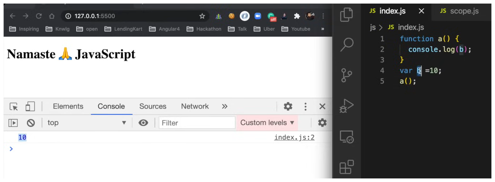
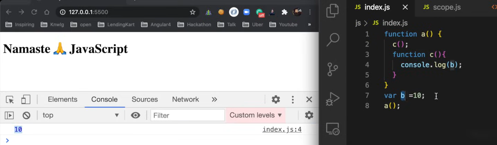
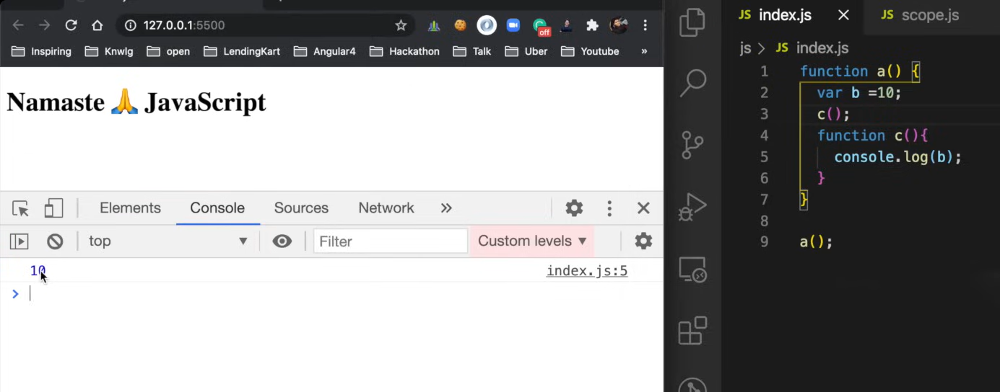
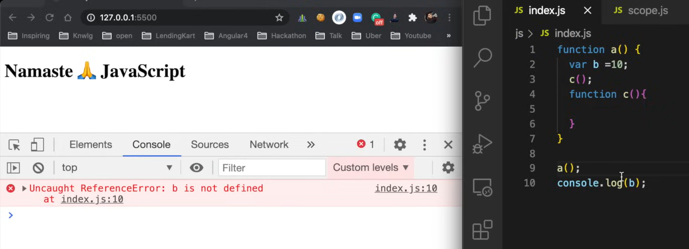
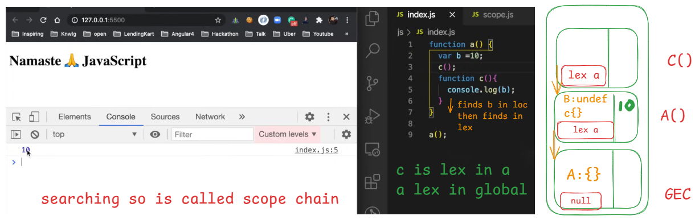

# 🧠 Lexical Environment in JavaScript

Every time a function is executed, a **Lexical Environment** is created.

A **Lexical Environment = Local Memory + Reference to the Parent's Lexical Environment**

---

## 🔍 What is a Lexical Environment?

> The environment in which variables and functions are **physically written (lexically scoped)** in the code.

### 📦 It consists of:
- **Local memory**: variables/functions declared inside the current scope
- **Outer environment reference**: a pointer to its parent lexical environment

