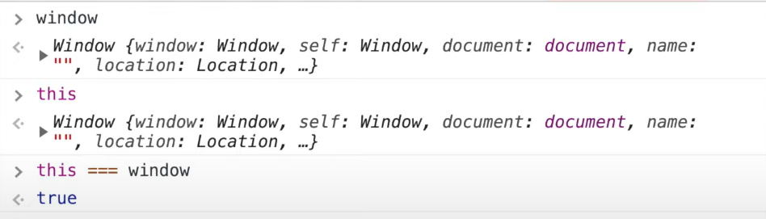
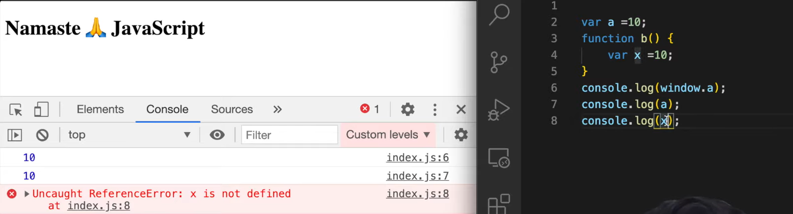

# 🌐 The `window` Object in JavaScript

When JavaScript code runs in a browser, an **Execution Context** is created. As part of this:

- A **global object** is created.
- A special object called `this` is assigned.
- In the **browser**, this global object is the `window`.

---

## 🧠 What is the `window`?

> `window` is the **global object** in the browser environment.  
> It provides access to global variables, functions, the DOM, timers, and more.

