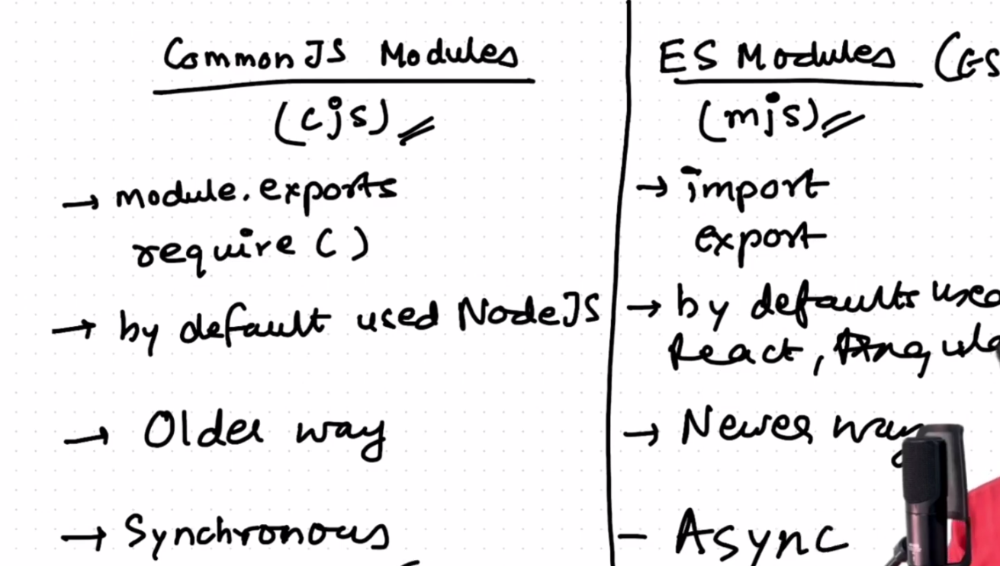

# 📦 Node.js Modules: `module.exports` and `require()`

Node.js uses the **CommonJS module system**, which allows us to **export functions, objects, or variables** from one file and **import** them into another using `require()`.

---

## 🧾 Table of Contents

- [🔧 What is `module.exports`?](#-what-is-moduleexports)
- [📥 How `require()` Works](#-how-require-works)
- [📁 Project File Structure](#-project-file-structure)
- [🚀 Example Usage](#-example-usage)
- [🔁 Exporting Multiple Things](#-exporting-multiple-things)
- [📍 Absolute vs Relative Path](#-absolute-vs-relative-path)
- [🧠 Notes](#-notes)
- [📚 References](#-references)

---

## 🔧 What is `module.exports`?

In Node.js, every file is treated as a **separate module**. To **share data** (functions, objects, variables) between files, we use:

```js
// In a file (say exportAndRequire.js)
module.exports = something;
```
# 🚀 Node.js Modules & `require()` Explained

Welcome to a quick and effective guide on how to **export and import modules in Node.js** using CommonJS (`require`, `module.exports`)! Perfect for MERN Stack beginners and Node.js learners.

---

## 📤 Exporting a Single Function

**File: `exportAndRequire.js`**
```js
// exporting a function
function greet(name) {
  return `Hello, ${name}!`;
}

module.exports = greet;
```

**File: `main.js`**
```js
// importing the function
const greet = require('./exportAndRequire');

console.log(greet('Node.js')); // Output: Hello, Node.js!
```

---

## 🔁 Exporting Multiple Functions

**File: `mathUtils.js`**
```js
function add(a, b) {
  return a + b;
}

function multiply(a, b) {
  return a * b;
}

module.exports = { add, multiply };
```

**File: `app.js`**
```js
const math = require('./mathUtils');

console.log(math.add(2, 3));      // 5
console.log(math.multiply(4, 5)); // 20
```

---

## 📍 Path Types in `require()`

| 🔗 Path Type | 🔤 Syntax         | 💡 Example                        |
|-------------|------------------|----------------------------------|
| Relative    | `./`, `../`      | `require('./utils')`             |
| Absolute    | Using `__dirname`| `require(__dirname + '/utils')`  |
| Built-in    | No path required | `require('fs')`, `require('http')` |

---

## 🧠 Key Notes

- `module.exports` is what `require()` returns when importing a file.
- Each file has its own **`module` object** in Node.js.
- You can export:
  - ✅ Functions  
  - ✅ Objects  
  - ✅ Classes  
  - ✅ Variables  

---

## 📚 References

- 📖 [Node.js Official Documentation on Modules](https://nodejs.org/docs/latest/api/modules.html)
- 📘 [CommonJS Modules Spec](https://requirejs.org/docs/commonjs.html)

---

> 💡 This guide is your go-to when you start building backend logic in your **MERN stack** projects using **Node.js**!

----

# 📘 Understanding `require()` in Node.js

In **Node.js**, the `require()` function is used to **import another module**.  
But it's important to understand what is **actually being shared or just executed**.

---

## 🔹 Case 1: Just Requiring a File (Only Executes It)

If the module does **not export anything**, then `require()` will simply **run the file once** when it's imported.

### 📄 `logger.js`

```js
// logger.js
console.log("Logging module executed!");
const name = "Logger Module";

function log(message) {
  console.log("Log:", message);
}
```

### 📄 `main.js`

```js
// main.js
require('./logger');
```

### ✅ Output:

```
Logging module executed!
```

> ❌ You **cannot access** `name` or `log()` in `main.js`  
> because **nothing was exported** from `logger.js`.

---

## 🔹 Case 2: Using `module.exports` to Share Variables and Functions

To **reuse variables or functions**, they must be **exported** from the module.

### 📄 `logger.js`

```js
// logger.js
const name = "Logger Module";

function log(message) {
  console.log(`[${name}] ${message}`);
}

// Export variables and functions
module.exports = { name, log };
```

### 📄 `main.js`

```js
// main.js
const logger = require('./logger');

console.log(logger.name);         // → Logger Module
logger.log("Hello from main!");   // → [Logger Module] Hello from main!
```

---

## ⚠️ Key Takeaways

| Concept                     | Behavior                          |
|----------------------------|-----------------------------------|
| `require('./file')`        | Executes the file once            |
| No `module.exports` used   | Nothing can be reused outside     |
| Use `module.exports`       | To share variables/functions      |
| `require()` returns exports| You can use them in your code     |

---

## 🧠 Why This Matters?

In real-world Node.js projects (like APIs or CLI tools), it's important to:

- ✅ Split logic across multiple files  
- ✅ Export functions like `getUser()`, `connectDB()`  
- ✅ Reuse them using `require()`  


### 🧠 Using explicit key-value pairs in an object.

## ✅ Example: module.exports = { x: x, calsum: calsum }
```
📄 calculator.js

// calculator.js

const x = 10;

function calsum(a, b) {
  return a + b;
}

// Exporting both using object syntax
module.exports = {
  x: x,
  calsum: calsum
};
This is the explicit version of shorthand:

module.exports = { x, calsum };
📄 main.js

// main.js

const calc = require('./calculator');

console.log("x:", calc.x);                      // ➤ x: 10
console.log("Sum of 4 and 7:", calc.calsum(4, 7)); // ➤ Sum of 4 and 7: 11

```


