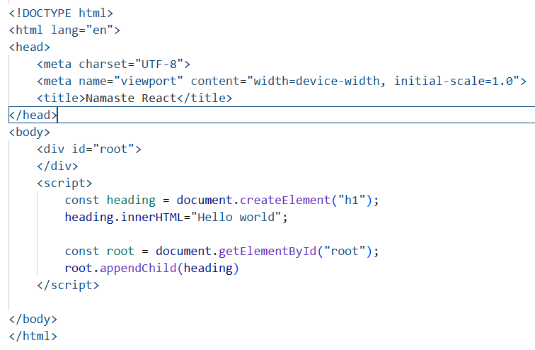
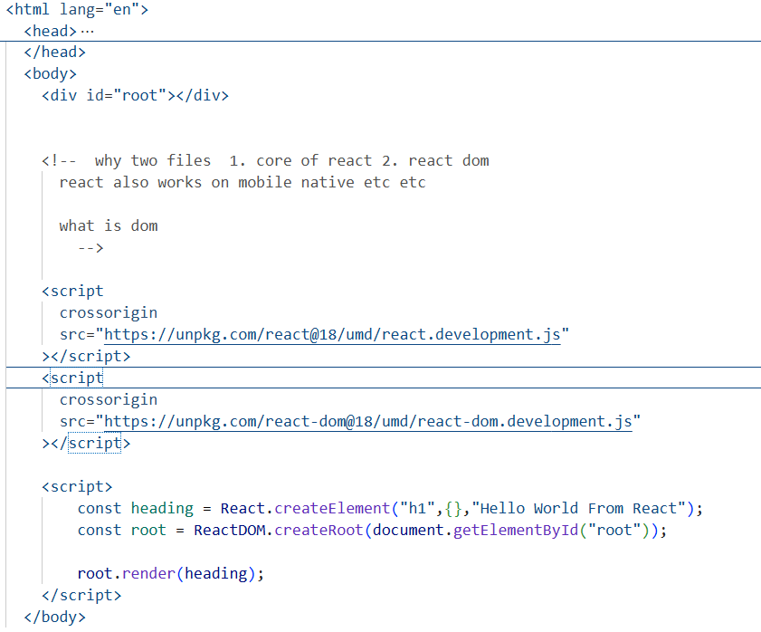

# INCEPTION

- Vs code use Emmet

The Browsers can understand the above code because of the js engines

But they cannot understand the  recat so we need to install it manually using cdn 

 

 <!-- 
        1. JAVASCRIPT
        2. REACT
        3. NODEJS 
        4. HTML & CSS
        5. BASIC PROJECTS
   -->

   